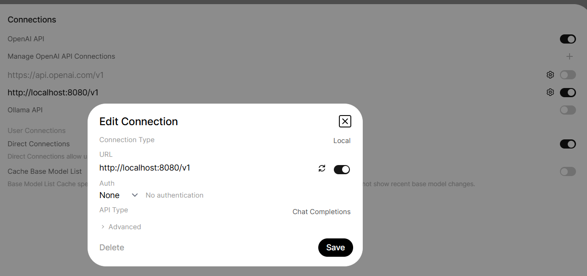

# Local RAG Question & Answer System

## Tech stack

- Python
- Poetry
- LlamaIndex
- ChromaDB
- Ollama
- Open WebUI
- `BAAI/bge-m3`

# Requirements

## Poetry: 

```bash
pipx install poetry
```

## Ollama: 

```bashbash
irm https://ollama.com/install.ps1 | iex #windows
curl -fsSL https://ollama.com/install.sh | sh #mac
```

## Install

```bash
poetry install
```


## Run the system

```bash
ollama # start ollama server
./_start_openui.sh #start the front-end, which is kind of clone of ChatGPT
./_start_api.sh    #starts a API to the front-end connects to and serves the RAG pipeline
```
Swagger UI is available at `http://localhost:8000`

### Configure back-end API address on UI


## Index documents

* Use the notebook `rag_pipeline_colab.ipynb` on Colab to run the ingestion pipeline and build the Chroma database.
* Then, copy the outcome (the database file to inside data/chroma) to your local machine.

```bash
poetry run rag-index
```