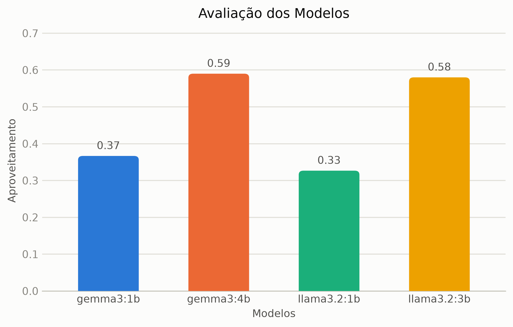
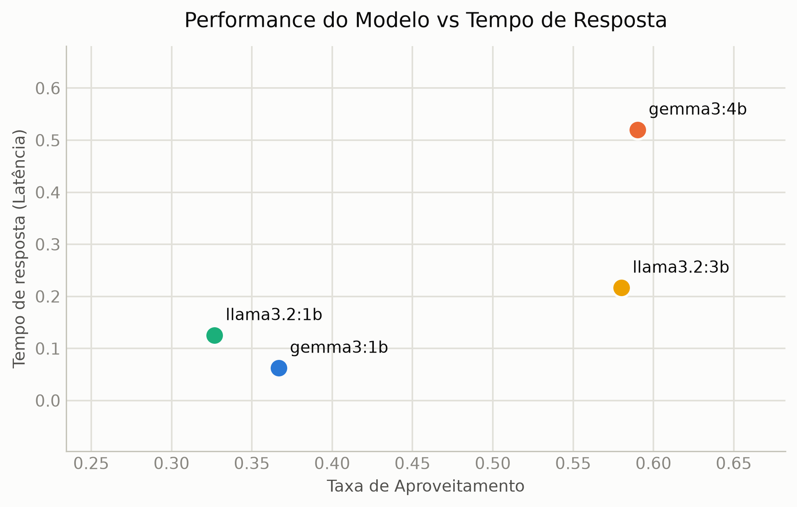

# Models Evaluation

## Introduction

In this document, it is explained the methodology behind the models evaluation. For this experiments, it were considered four different language models, as follow:

- gemma3:1b
- gemma3:4b
- llama3.2:1b
- llama3.2:3b

All models mentioned can be acquired using *Ollama* and *Hugging Face*. It is also important to mentioned that for the RAG construction it was only considered the *BAAI/bge-m3* embedding model.

## Experiment Description

The purpose for the models evaluation was a *contest* between the models, where for a list of *100 questions*, the model's answers were compared against each other in pairs, which means six games between the models for each question. The decision for the best answers was provided by four LLMs models:

- claude-sonnet-4-5
- claude-haiku-4-5
- claude-sonnet-5
- claude-sonnet-4-6

From now on these bigger models will be referred as *judges* for pedagogical purposes. Each judge decided which answer was the best. The judge could opt for a tie. The answers that had more votes would be the winner. As consequence, the model which provided this answer gain 1 point. In case of a tie, no points were acquired.

Some important points to be noticed:

1. Each model, at most, could receive 300 points. This is the case where the model won all games;

2. If $N_{m}$ is the number of models and $N_{q}$ the number of question, the total number of games $T_{g}$ between the models are given by $$T_{g} = \left[ \frac{N_{m}(N_{m}-1)}{2} \right] N_{q}.$$ As consequence, $T_{g}$ grows polynomially in $N_{m}$ and linearly in $N_{q}$, which means that increasing the number of models could make this experiment computationally intense;

3. It was computed and saved a latency time, which was, in average, the time required by the model to answers the question. This latency time will be relevant soon;

4. The choice of 100 for the number of question is mostly because 100 is a kind of "cabalistic number". Apart from this joke, the number of question could be greater, improving the statistical confidence of the experiment. However, it also would require more time to the models generate the answers, which can variate depending on the computational resources, and token usage because the judges are LLM models from an external provider. 

## Results

The results of the experiment are shown in the figures bellow. The evaluation score is "normalized" by a division for 300, which is not a magic number, but the maximum number of points that a model could achieve in the contest. In the end, the evaluation score is just the *win rate* of the model in the contest.

The latency time is also normalized considering the greatest response time from a model call. How the latency time will depend on the computational resources available during the experiment run, it can vary a lot. In this sense, a normalized number could be easier to compare in case the experiment would be run again in a better machine.

<figure style="text-align: center;">
  
  <figcaption>Figure 1: Model evaluation obtained by each model across 100 questions, pairwise-comparison contest, as judged by four LLM judges.</figcaption>
</figure>

It is possible to see that the models *gemma3:4b* and *llama3.2:3b* had a significant better performance than the other models. Between these two models, it is fair to say that they had the same performance, which means that both could be a good choice for out Cat-Gpt application.

<figure style="text-align: center;">
  
  <figcaption>Figure 2: Evaluation score compared with the median latency time for each model.</figcaption>
</figure>

However, crossing the performance of the model with the latency, in the experiments, the *llama3.2:3b* presented a far better latency than its opponent. 

## Conclusion

After the model evaluation experiment, considering both latency time and model performance, it is clear that the **llama3.2:3b** was the winner. There are many other models available to be tested, but from the sample of models considered here, the **llama3.2:3b** performed better comparing with *llama3.2:1b* and *gemma3:1b*, presenting also a better latency time than its direct opponent *gemma3:4b*.